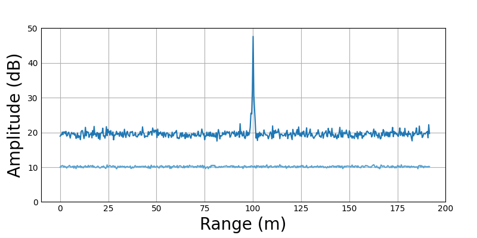

### RadarSimPy Configuration Capture

#### Config Settings
*There are some small configurations that need to be captured for [radarsimpy](https://radarsimx.com/radarsimx/radarsimpy/).*
- Removed the dependency on plotly
- Added python requirements with locked in versions

#### Linux
*Current purchased license is for Ubuntu 22.04 and CUDA version 12.8 and python3.10* 

Add 'import pkgutil' to mesh_kit.py as first import 

- FMCW_radar_link_budet.py
- radarsimpy (free trial from radarsimpy)
    - __init__.py
    - libradarsimcpp.so
    - simulator.xxx.so
    - radar.py
    - processing.py

#### Example output with configuration properly setup

